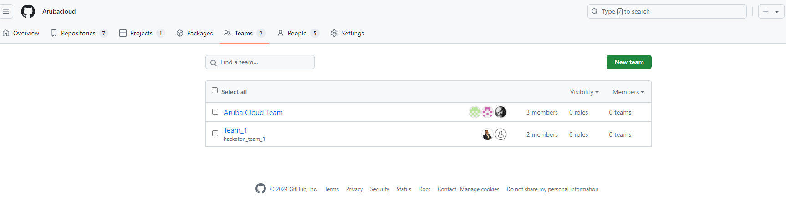
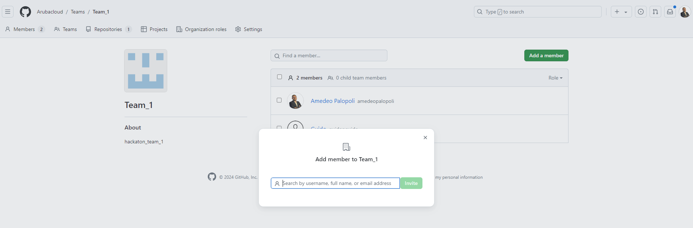
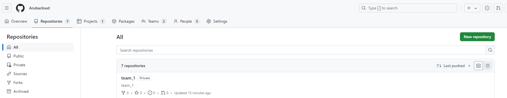
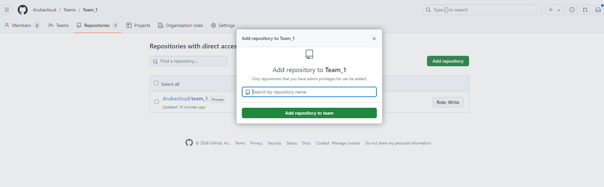
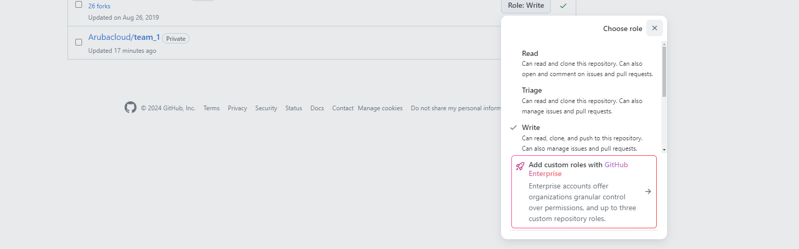

# Steps to be Onboarded for the Hackathon

1. **Fill up registration details.**

2. **Github Team creation within Arubacloud Organization.**

   

3. **Invite Members to the associated Team.**

   

4. **Create a Repository for each team.**

   

5. **Assign the private repository created in the previous step to the team.**

   

6. **Make sure to assign the write role to the team to enable code push.**

   

---

# Task Points

| Title                  | Task                                                                                         | Note                                                                                                                       | Points | Topic               |
|------------------------|----------------------------------------------------------------------------------------------|----------------------------------------------------------------------------------------------------------------------------|--------|---------------------|
| **CLI**                | Design and develop a cross-platform Command Line Interface (CLI) to use Aruba Cloud APIs      | **Must:** Develop a Golang CLI [Go CLI solutions](https://go.dev/solutions/clis).                                           | 50     | All Aruba Cloud APIs |
|                        |                                                                                              | **Examples:**                                                                                                              |        |                     |
|                        |                                                                                              | - [LiqoCTL](https://github.com/liqotech/liqo/tree/master/pkg/liqoctl)                                                      |        |                     |
|                        |                                                                                              | - [Hetzner](https://github.com/hetznercloud/cli)                                                                           |        |                     |
|                        |                                                                                              | - [DigitalOcean](https://github.com/digitalocean/doctl)                                                                    |        |                     |
| **Kubernetes Autoscaler**| Use Aruba Cloud APIs to deliver a Kubernetes Cluster Autoscaler                              | [Kubernetes Autoscaler](https://github.com/kubernetes/autoscaler)                                                          | 20     | Kubernetes          |
|                        |                                                                                              | **Example:** [Kubernetes Autoscaler Example](https://github.com/kubernetes/autoscaler/tree/c6b754c359a8563050933a590f9a5dece823c836/cluster-autoscaler) |        |                     |
| **Terraform Provider**  | Develop a Terraform Provider                                                                 | [Terraform Custom Provider](https://spacelift.io/blog/terraform-custom-provider)                                            | 20     | All Aruba Cloud APIs |
|                        |                                                                                              | **Example:** [Custom Provider Example](https://spacelift.io/blog/terraform-custom-provider)                                 |        |                     |
| **Aruba Cloud SDK**     | Choose a language to deliver an Aruba Cloud Management SDK                                    |                                                                                                                            | 10     | All Aruba Cloud APIs |
|                        |                                                                                              | **DotNet Example:** [Azure SDK for .NET](https://github.com/Azure/azure-sdk-for-net/tree/main)                              |        |                     |
|                        |                                                                                              | **Java Example:** [VMWare vSphere Automation SDK for Java](https://github.com/vmware/vsphere-automation-sdk-java)           |        |                     |
|                        |                                                                                              | **Python Example:** [Hetzner Cloud SDK for Python](https://github.com/hetznercloud/hcloud-python)                           |        |                     |

---
